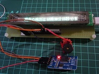
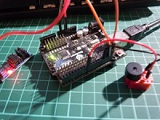
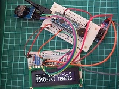
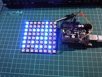
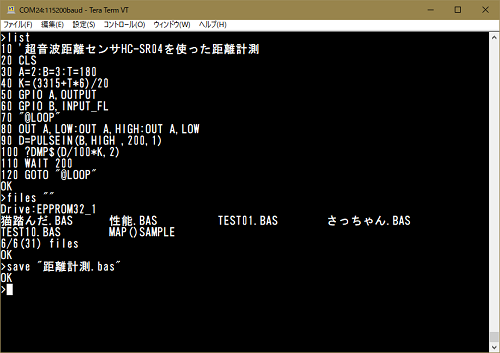
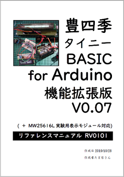

# 豊四季タイニーBASIC for Arduino機能拡張版 V0.08

     

  
  
本プログラムは、オリジナル版「**TOYOSHIKI Tiny BASIC for Arduino**」を 機能拡張したバージョンです。  

- オリジナル版配布サイト：<https://github.com/vintagechips/ttbasic_arduino>
- ​関連情報：  [電脳伝説 Vintagechips - 豊四季タイニーBASIC確定版](https://vintagechips.wordpress.com/2015/12/06/%E8%B1%8A%E5%9B%9B%E5%AD%A3%E3%82%BF%E3%82%A4%E3%83%8B%E3%83%BCbasic%E7%A2%BA%E5%AE%9A%E7%89%88/)  

## 更新情報

- 2020/08/20 ttconfig.hの修正（MW25616Lボード専用条件設定の追加）
- 2020/07/27 Arduino Arduino Unoでのコンパイルエラー不具合対応  
- 2020/02/20 Arduino Mega2560でフルスクリーンエディタ対応  
- 2019/11/14 リファレンスマニュアル(PDF)の更新 （⇒ 正式版 R0102-2）、BSキー不具合対応
- 2019/11/02 リファレンスマニュアル(PDF)の更新 （⇒ 正式版 R0102-1）
- 2019/11/01 リファレンスマニュアル(PDF)の更新 （⇒ 正式版 R0102）、単独Else追加
- 2019/10/29 リファレンスマニュアル(PDF)の更新 （⇒ 正式版 R0101）

## 対応ハードウェア

- Arduino Unoおよびその互換機（Arduino Nano、Pro Minoにも対応）
- Arduino MEGA2560及びその互換機
- MW25616L実験用表示モジュール用デモプログラム

## ファームウェア書込み環境

- Arduino IDE 1.8.9（Windows 10等のプラットフォームを含む）以降推奨

## 利用環境

- ターミナルソフト (TeraTerm を推奨、Windows 10等のプラットフォームを含む）

## 主な機能拡張

- シリアルコンソール画面制御機能（CLS、LOCATE、COLOR、ATTRコマンド）

  日本語シフトJIS文字もサポートします。

- ラインエディタの編集機能拡張（Arduino Unoの場合）

  - 編集キー [←] [→] によるカーソル移動
  - 編集キー[↑] [↓]、 [PageUP][PageDOWN] による上下の行の表示
  - 編集キー[BS]、[DEL]による文字削除
  - 編集キー[HOME] [END] による行先頭、行末へのカーソール移動
  - 行番号 [TAB]による、指定行の表示
  - エラー発生時、[TAB]による該当行の表示
  - [F2]キー、[CTRL+D]による、行クリア
  - [F1]キー、[CTRL+L]による、画面クリア

- スクリーンエディタ対応（Arduino Mega2560の場合）

- 内部EEPROM及びI2C接続EEPROMへのプログラム保存・読み込み（SAVE、LOAD、RRASE、FILES）

- GPIOを使った入出力（デジタル入出力、アナログ入力、PWM、I2C、パルス入力等）

- 単音出力（PLAYコマンドによるMML演奏、TONEコマンドによる指定周波数音出力）

- I2C接続 RTC DS3231対応（SETDATE、GETDATE、GETTIMEコマンド）

- 赤外線リモコン受信対応(IR() 関数)

- NeoPixel(WS2812B)対応（リボン・テープ形状、リンク形状、8x8ドットマトリックス形状）

- 8x8ドット 美咲フォント（シフトJIS 全角500字：英数記号・カタカナ・ひらがな・漢字）

- タイマーイベント（ON TIMER ミリ秒 GOSUB|GOTO,TIMER ON|OFFコマンド）

- 外部割込みイベント（ON EXT ピン番号,LOW|RISING|FALLING|CHANGE GOSUB|GOTO、PIN ピン番号,ON|OFF）

- SLEEP機能（SLEEPコマンド)

- 「 MW25616L実験用表示モジュール(Arduino 互換)」対応（※スケッチコンパイルの設定にて対応）

  - VFDディスプレイ制御（文字の表示、輝度設定等）

  - 日本語漢字フォント ROM GT20L16J1Y対応（16x16ドット日本語表示対応）
    ​

本プログラムに実装においては、下記の公開ソースの一部を流用しています。  

- mcursesライブラリ（組込済み）  
<https://github.com/ChrisMicro/mcurses>

- MW25616L実験用表示モジュール用デモプログラム（一部組込済み）  
<http://vfd-fun.blogspot.jp/>

- TimerOne Library（組込済み）  
<https://github.com/PaulStoffregen/TimerOne>

- 美咲フォント  
<http://littlelimit.net/misaki.htm>

その他の利用方法については、付属のリファレンス・マニュアル(PDF形式)を参照して下さい。  
 

## スケッチコンパイルオプションについて

**Arduino Uno**では、フラッシュメモリ及びSRAMの容量の制約から、全ての機能を同時に利用することが出来ません。  
必要に応じて、`ttconfig.h`の下記の設定にて利用する機能を有効・無効化を定義して下さい。
**Arduino Uno** と **Arduino MEGA2560**では独立した定義となります。  
**Arduino MEGA2560**では、VFD以外は全ての機能が有効設定になっています。  

```cpp
#define USE_MW25616L  0 // MW25616L 実験用表示モジュールを利用 1: 利用しない:0 （デフォルト:0）

// ** シリアルポート通信速度 *************************************************
#define SERIALBAUD 115200

// ** 利用ピン設定 **********************************************************
#ifdef ARDUINO_AVR_MEGA2560
  // Arduino MEGA2560
  #define   TonePin 49  // Tone用出力ピン（圧電スピーカー接続）
  #define   AutoPin 53  // 自動起動チェックピン
#else
  // Arduino Uno/nano/pro mini
  #define   TonePin 8  // Tone用出力ピン（圧電スピーカー接続）
  #define   AutoPin 7  // 自動起動チェックピン
#endif

// ** プログラム領域サイズ ***************************************************
#ifdef ARDUINO_AVR_MEGA2560
  // Arduino MEGA2560
  #define   PRGAREASIZE 2048 // プログラム領域サイズ(Arduino Mega 512 ～ 4096 デフォルト:2048)
  #define   ARRYSIZE    100  // 配列領域
#else
  // Arduino Uno/nano/pro mini
  #define   PRGAREASIZE 1024 // プログラム領域サイズ(Arduino Uno  512 ～ 1024 デフォルト:1024)
  #define   ARRYSIZE    32   // 配列領域
#endif

#define USE_ALL_KEYWORD  1   // 未使用キーワードも有効にする(1:有効 2:無効 デフォルト:1)
#define USE_FULLSCREEN   1   // Mega2560フルスクリーンエディタ対応(1:有効 2:無効 デフォルト:1)

#ifndef ARDUINO_AVR_MEGA2560
#if !USE_MW25616L
// ** 機能利用オプション設定 for Arduino Uno *********************************
#define USE_CMD_PLAY   0  // PLAYコマンドの利用(0:利用しない 1:利用する デフォルト:0)
#define USE_CMD_I2C    1  // I2Cコマンドの利用(0:利用しない 1:利用する デフォルト:1)
#define USE_PULSEIN    1  // PULSEIN関数の利用(0:利用しない 1:利用する デフォルト:1)
#define USE_SHIFTIN    1  // SHIFTIN関数の利用(0:利用しない 1:利用する デフォルト:1)
#define USE_SHIFTOUT   1  // SHIFTOUTコマンドの利用(0:利用しない 1:利用する デフォルト:1)
#define USE_CMD_VFD    0  // VFDモジュールコマンドの利用(0:利用しない 1:利用する デフォルト:0)
#define USE_RTC_DS3231 0  // I2C接続RTC DS3231の利用(0:利用しない 1:利用する デフォルト:0)
#define USE_I2CEEPROM  1  // I2C EEPROM対応(0:利用しない 1:利用する デフォルト:1)
#define USE_SYSINFO    1  // SYSINFOコマンド(0:利用しない 1:利用する デフォルト:1)
#define USE_GRADE      1  // GRADE関数(0:利用しない 1:利用する デフォルト:1)
#define USE_DMP        1  // DMP$関数(0:利用しない 1:利用する デフォルト:1)
#define USE_IR         1  // IR関数(0:利用しない 1:利用する デフォルト:1)
#define USE_ANADEF     1  // アナログピン定数A0～A7orA15(0:利用しない 1:利用する デフォルト:1)
#define USE_SO1602AWWB 0  // 有機ELキャラクタディスプレイ SO1602AWWB(0:利用しない 1:利用する デフォルト:0)
#define USE_MISAKIFONT 0  // 美咲フォント500文字の利用(0:利用しない 1:利用する 2:非漢字のみ利用 デフォルト:0)
#define USE_NEOPIXEL   0  // NeoPixelの利用(0:利用しない 1:利用する デフォルト:0)
#define USE_EVENT      1  // タイマー・外部割込みイベントの利用(0:利用しない 1:利用する デフォルト:1)
#define USE_SLEEP      1  // SLEEPコマンドの利用(0:利用しない 1:利用する デフォルト:1) ※USE_EVENTを利用必須
#else
// ** 機能利用オプション設定 for MW25616L 実験用表示モジュール*********************
#define USE_CMD_PLAY   1  // PLAYコマンドの利用(0:利用しない 1:利用する デフォルト:0)
#define USE_CMD_I2C    1  // I2Cコマンドの利用(0:利用しない 1:利用する デフォルト:1)
#define USE_PULSEIN    1  // PULSEIN関数の利用(0:利用しない 1:利用する デフォルト:1)
#define USE_SHIFTIN    1  // SHIFTIN関数の利用(0:利用しない 1:利用する デフォルト:1)
#define USE_SHIFTOUT   1  // SHIFTOUTコマンドの利用(0:利用しない 1:利用する デフォルト:1)
#define USE_CMD_VFD    1  // VFDモジュールコマンドの利用(0:利用しない 1:利用する デフォルト:0)
#define USE_RTC_DS3231 1  // I2C接続RTC DS3231の利用(0:利用しない 1:利用する デフォルト:0)
#define USE_I2CEEPROM  0  // I2C EEPROM対応(0:利用しない 1:利用する デフォルト:1)
#define USE_SYSINFO    1  // SYSINFOコマンド(0:利用しない 1:利用する デフォルト:1)
#define USE_GRADE      1  // GRADE関数(0:利用しない 1:利用する デフォルト:1)
#define USE_DMP        1  // DMP$関数(0:利用しない 1:利用する デフォルト:1)
#define USE_IR         1  // IR関数(0:利用しない 1:利用する デフォルト:1)
#define USE_ANADEF     1  // アナログピン定数A0～A7orA15(0:利用しない 1:利用する デフォルト:1)
#define USE_SO1602AWWB 0  // 有機ELキャラクタディスプレイ SO1602AWWB(0:利用しない 1:利用する デフォルト:0)
#define USE_MISAKIFONT 0  // 美咲フォント500文字の利用(0:利用しない 1:利用する 2:非漢字のみ利用 デフォルト:0)
#define USE_NEOPIXEL   0  // NeoPixelの利用(0:利用しない 1:利用する デフォルト:0)
#define USE_EVENT      0  // タイマー・外部割込みイベントの利用(0:利用しない 1:利用する デフォルト:1)
#define USE_SLEEP      0  // SLEEPコマンドの利用(0:利用しない 1:利用する デフォルト:1) ※USE_EVENTを利用必須
#endif
#else
// ** 機能利用オプション設定 for Arduino MEGA2560******************************
#define USE_CMD_PLAY   1  // PLAYコマンドの利用(0:利用しない 1:利用する デフォルト:1)
#define USE_CMD_I2C    1  // I2Cコマンドの利用(0:利用しない 1:利用する デフォルト:1)
#define USE_PULSEIN    1  // PULSEIN関数の利用(0:利用しない 1:利用する デフォルト:1)
#define USE_SHIFTIN    1  // SHIFTIN関数の利用(0:利用しない 1:利用する デフォルト:1)
#define USE_SHIFTOUT   1  // SHIFTOUTコマンドの利用(0:利用しない 1:利用する デフォルト:1)
#define USE_CMD_VFD    0  // VFDモジュールコマンドの利用(0:利用しない 1:利用する デフォルト:0)
#define USE_RTC_DS3231 1  // I2C接続RTC DS3231の利用(0:利用しない 1:利用する デフォルト:1)
#define USE_I2CEEPROM  1  // I2C EEPROM対応(0:利用しない 1:利用する デフォルト:1)
#define USE_SYSINFO    1  // SYSINFOコマンド(0:利用しない 1:利用する デフォルト:1)
#define USE_GRADE      1  // GRADE関数(0:利用しない 1:利用する デフォルト:1)
#define USE_DMP        1  // DMP$関数(0:利用しない 1:利用する デフォルト:1)
#define USE_IR         1  // IR関数(0:利用しない 1:利用する デフォルト:1)
#define USE_ANADEF     1  // アナログピン定数A0～A7orA15(0:利用しない 1:利用する デフォルト:1)
#define USE_SO1602AWWB 1  // 有機ELキャラクタディスプレイ SO1602AWWB(0:利用しない 1:利用する デフォルト:1)
#define USE_MISAKIFONT 1  // 美咲フォント500文字の利用(0:利用しない 1:利用する 2:非漢字のみ利用 デフォルト:1)
#define USE_NEOPIXEL   1  // NeoPixelの利用(0:利用しない 1:利用する デフォルト:1)
#define USE_EVENT      1  // タイマー・外部割込みイベントの利用(0:利用しない 1:利用する デフォルト:1)
#define USE_SLEEP      1  // SLEEPコマンドの利用(0:利用しない 1:利用する デフォルト:1) ※USE_EVENTを利用必須
#endif```

以下はオリジナル版のドキュメントです。  

------

TOYOSHIKI Tiny BASIC for Arduino

The code tested in Arduino Uno R3.<br>
Use UART terminal, or temporarily use Arduino IDE serial monitor.

Operation example

&gt; list<br>
10 FOR I=2 TO -2 STEP -1; GOSUB 100; NEXT I<br>
20 STOP<br>
100 REM Subroutine<br>
110 PRINT ABS(I); RETURN

OK<br>
&gt;run<br>
2<br>
1<br>
0<br>
1<br>
2

OK<br>
&gt;

The grammar is the same as<br>
PALO ALTO TinyBASIC by Li-Chen Wang<br>
Except 3 point to show below.

(1)The contracted form of the description is invalid.

(2)Force abort key<br>
PALO ALTO TinyBASIC -> [Ctrl]+[C]<br>
TOYOSHIKI TinyBASIC -> [ESC]<br>
NOTE: Probably, there is no input means in serial monitor.

(3)Other some beyond my expectations.

(C)2012 Tetsuya Suzuki<br>
GNU General Public License
