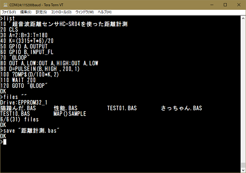

## 豊四季タイニーBASIC for Arduino機能拡張版

  

本プログラムは、オリジナル版「**TOYOSHIKI Tiny BASIC for Arduino**」を 機能拡張したバージョンです。  
​	オリジナル版配布サイト <https://github.com/vintagechips/ttbasic_arduino>  
​		関連情報 電脳伝説 Vintagechips - 豊四季タイニーBASIC確定版  

  

**対応ハードウェア**

- Arduino Unoおよびその互換機（Arduino Nano、Pro Minoにも対応）
- MW25616L実験用表示モジュール用デモプログラム

**ファームウェア書込み環境**

- Arduino IDR 1.8.5（Windows 10等のプラットフォームを含む）

**利用環境**

- ターミナルソフト (TeraTerm を推奨、Windows 10等のプラットフォームを含む）

**主な機能拡張**

- シリアルコンソール画面制御機能（CLS、LOCATE、COLOR、ATTRコマンド）

  日本語シフトJIS文字もサポートします。

- ラインエディタの編集機能拡張

  - 編集キー 「←」「→」によるカーソル移動
  - 編集キー「↑」「↓」「UP」「DOWN」による上下の行の表示
  - 編集キー「BS」「DEL」による文字削除
  - 編集キー「HOME」「END」による行先頭、行末へのカーソール移動
  - 行番号 [TAB]による、指定行の表示
  - エラー発生時、[TAB]による該当行の表示
  - [F2]キーによる、行クリア
  - [F1]キーによる、画面クリア

- 内部EEPROM及びI2C接続EEPROMへのプログラム保存・読み込み（SAVE、LOAD、RRASE、FILES）

- GPIOを使った入出力（デジタル入出力、アナログ入力、PWM、I2C、パルス入力等）

- 単音出力（PLAYコマンドによるMML演奏、TONEコマンドによる指定周波数音出力）

- I2C接続 RTC DS3231対応（SETDATE、GETDATE、GETTIMEコマンド）

- 「 MW25616L実験用表示モジュール(Arduino 互換)」対応（※スケッチコンパイルの設定にて対応）

  - VFDディスプレイ制御（文字の表示、輝度設定等）

  - 日本語漢字フォント ROM GT20L16J1Y対応（16x16ドット日本語表示対応）
    ​

本プログラムに実装において、下記の公開ソースの一部を流用しています。  
- mcursesライブラリ（組込済み）  
  <https://github.com/ChrisMicro/mcurses>

- MW25616L実験用表示モジュール用デモプログラム（組込済み）  
  http://vfd-fun.blogspot.jp/

その他の利用方法については、付属のリファレンス・マニュアルを参照して下さい。  

以下はオリジナル版のドキュメントです。  

------

TOYOSHIKI Tiny BASIC for Arduino

The code tested in Arduino Uno R3. 
Use UART terminal, or temporarily use Arduino IDE serial monitor.

Operation example

&gt; list 
10 FOR I=2 TO -2 STEP -1; GOSUB 100; NEXT I 
20 STOP 
100 REM Subroutine 
110 PRINT ABS(I); RETURN

OK 
&gt;run 
2 
1 
0 
1 
2

OK 
&gt;

The grammar is the same as 
PALO ALTO TinyBASIC by Li-Chen Wang 
Except 3 point to show below.

(1)The contracted form of the description is invalid.

(2)Force abort key 
PALO ALTO TinyBASIC -> [Ctrl]+[C] 
TOYOSHIKI TinyBASIC -> [ESC] 
NOTE: Probably, there is no input means in serial monitor.

(3)Other some beyond my expectations.

(C)2012 Tetsuya Suzuki 
GNU General Public License
