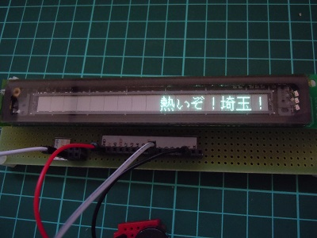

  

本プログラムは、オリジナル版「**TOYOSHIKI Tiny BASIC for Arduino**」を  
「 MW25616L実験用表示モジュール(Arduino 互換)」向けにカスタマイズしたバージョンです。   

本プログラムに実装において、下記の公開ソースの一部を流用しています。  
- mcursesライブラリ（組込済み）
  <https://github.com/ChrisMicro/mcurses>

- MW25616L実験用表示モジュール用デモプログラム（組込済み）  
  http://vfd-fun.blogspot.jp/

オリジナル版配布サイト <https://github.com/vintagechips/ttbasic_arduino>  
関連情報 電脳伝説 Vintagechips - 豊四季タイニーBASIC確定版  

以下はオリジナル版のドキュメントです。  

------

TOYOSHIKI Tiny BASIC for Arduino

The code tested in Arduino Uno R3. 
Use UART terminal, or temporarily use Arduino IDE serial monitor.

Operation example

&gt; list 
10 FOR I=2 TO -2 STEP -1; GOSUB 100; NEXT I 
20 STOP 
100 REM Subroutine 
110 PRINT ABS(I); RETURN

OK 
&gt;run 
2 
1 
0 
1 
2

OK 
&gt;

The grammar is the same as 
PALO ALTO TinyBASIC by Li-Chen Wang 
Except 3 point to show below.

(1)The contracted form of the description is invalid.

(2)Force abort key 
PALO ALTO TinyBASIC -> [Ctrl]+[C] 
TOYOSHIKI TinyBASIC -> [ESC] 
NOTE: Probably, there is no input means in serial monitor.

(3)Other some beyond my expectations.

(C)2012 Tetsuya Suzuki 
GNU General Public License
